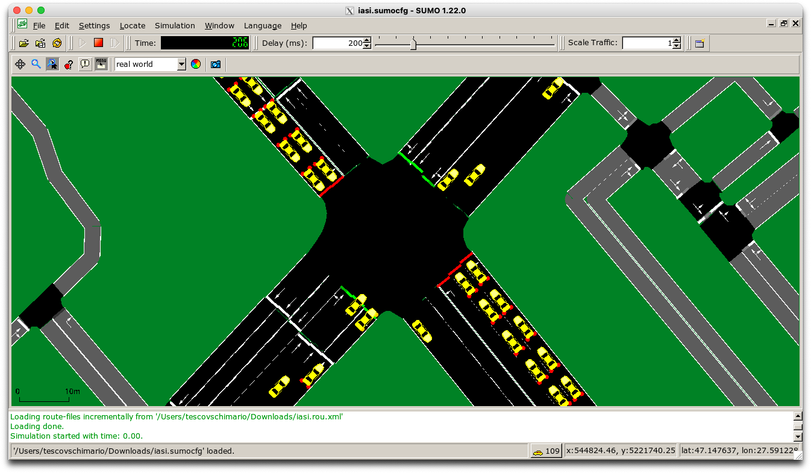
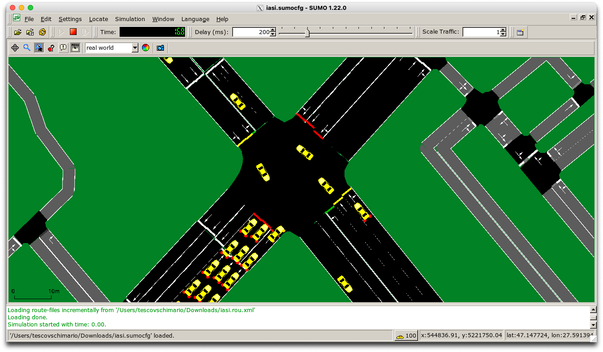

# Bachelor's Thesis

## April 9

I have started using SUMO to visualize the generated traffic. The image shows the Cotnari intersection, where Nicolae
Iorga Boulevard meets Socola Boulevard. When importing data from Overpass Turbo into SUMO Netedit, I noticed that the
traffic light data—specifically the timings and states—is missing and only approximated. This is a major issue if I want
the simulation to closely reflect reality.

Since obtaining complete data directly from a public institution is likely unfeasible—especially considering that by the
time they respond, I will have already finished university—I plan to explore alternative options. I will try to connect
with someone who works at a public institution and might have access to the necessary data. If that proves impossible, I
may need to estimate the timings by either guessing or by conducting on-site observations and manually recording each
cycle.

Meanwhile, I will focus on generating automated traffic flows and refine them as accurately as possible based on the
available information.

## March 30

I rushed into searching for the perfect dataset without even knowing exactly what I need or want for this project. I
don’t think there is a quick and easy answer to my question, so in the next few weeks, I will read the studies I can
find and explore the best way to generate the data myself using a digital replica of the city of Iași.

Getting access to live camera feeds in the city seems nearly impossible—especially considering that a simple request has
remained unanswered for over three weeks now. Even if I did get access, I would still need to implement a video-based
traffic analysis algorithm, which would require a significant amount of time and resources.

For now, I am looking into the option of recreating a realistic digital copy of Iași, or at least a large part of it,
using data from OpenStreetMap and refining it where necessary with JOSM. I will dedicate some time to understanding the
SUMO (Simulation of Urban MObility) software and attempting to simulate meaningful traffic data. As mentioned in *The
Effect of the Dataset on Evaluating Urban Traffic Prediction* study, additional factors such as weather conditions play
a crucial role in prediction models, so I will also investigate the feasibility of generating that data.

### Next Steps

- Replicating in digital the city of Iași
- Generate at least some urban traffic data
- Refine and improve the generated data for further analysis

## March 2025 - Dataset Search

1. **Request to Iași City Hall**
    - **Purpose**: Identify the institution responsible for traffic monitoring and verify whether such data is
      collected.
    - I also spoke with someone from the Iași Local Police, who stated that they do not collect traffic data. The
      surveillance cameras are used strictly for exceptional situations such as accidents and crimes.
    - **Status**: No response received.

2. **Request to the Center for Technical Road Studies and Informatics**
    - **Response**: The institution confirmed that *it does not conduct any measurements on national road sections
      administered by cities/municipalities*.

3. **Request to the Municipal Traffic Management Company of Bucharest**
    - **Status**: No response received.

4. **Requests for access to the [UTD19](https://utd19.ethz.ch) dataset**
    - Sent two requests to download the dataset.
    - **Status**: No response received.  
