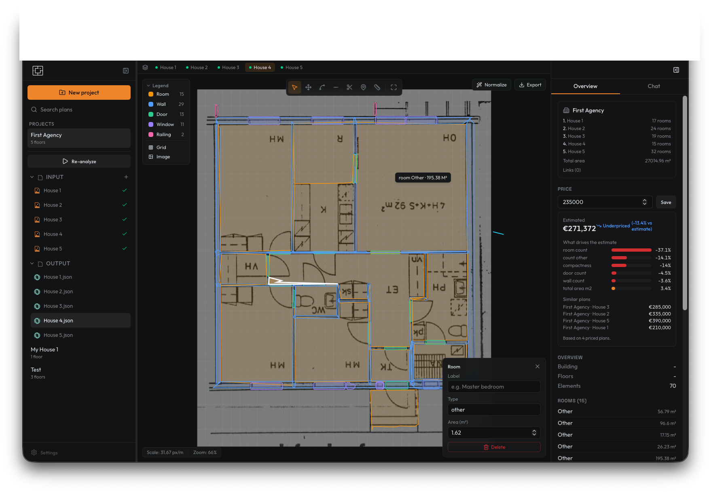

<div align="center">

# Mappa

### Floor plan image to structured, editable CAD

Turn a photo, scan, or PDF of a residential floor plan into a structured representation:
labeled room polygons, walls, doors, windows and railings, plus the relationships between
them. Then view, edit, query and export it from a CAD-like canvas.

</div>



<!-- TODO: replace with a demo video / GIF -->
<!-- Demo video: link coming soon -->

> **Status:** working end-to-end on residential floor plans. Local, single-user, no auth (by design).
> This is a bachelor's thesis project. The engineering rationale and experiment history live in [`docs/`](docs/).

---

## Table of contents

- [What it does](#what-it-does)
- [Features](#features)
- [How it works (architecture)](#how-it-works-architecture)
- [Tech stack](#tech-stack)
- [Repository layout](#repository-layout)
- [Getting started](#getting-started)
  - [Prerequisites](#1-prerequisites)
  - [Backend (geometry + API)](#2-backend-geometry--api)
  - [Modal (Qwen3-VL semantics)](#3-modal-qwen3-vl-semantics)
  - [Ollama (chat + search embeddings)](#4-ollama-chat--search-embeddings)
  - [Frontend](#5-frontend)
  - [Run everything](#6-run-everything)
- [Environment variables](#environment-variables)
- [Usage walkthrough](#usage-walkthrough)
- [Benchmarks](#benchmarks)
- [Training & experiments](#training--experiments)
- [Roadmap](#roadmap)
- [License & acknowledgements](#license--acknowledgements)

---

## What it does

Vision-language models read floor plans well at the *semantic* level (they know a kitchen
is a kitchen) but place geometry by reasoning rather than perceiving it pixel-by-pixel, so
their coordinates are unreliable. Mappa splits the problem so each component does what it is
good at:

- a **dedicated segmentation model** owns geometry (the *where*),
- a **vision-language model** owns semantics (the *what*),
- a **local LLM** lets you query and edit the result in natural language.

The three outputs are fused into a single structured `Document` you can render, edit and
export. On geometry this hybrid beats a monolithic frontier model decisively, loses only
marginally on semantics, and costs several times less per image (see [Benchmarks](#benchmarks)).

## Features

**Analysis pipeline**
- Upload images (photo / scan / PDF), automatic multi-floor detection and split.
- Pixel-precise geometry: room / wall / door / window / railing masks to polygons.
- Semantic labeling: room types, building type, adjacency, approximate areas, layout notes.
- Automatic scale calibration from the median door width; adjacency derived with `shapely`.

**Interactive CAD canvas**
- Konva-based viewer/editor: move elements, vertex editing, add walls, split rooms,
  calibrate scale, place annotations.
- Optimistic updates with undo/redo.
- **Immutable base + editable overlay**: the pipeline writes the base, every edit lands in
  the overlay, and *revert* simply discards the overlay so the base is never mutated.

**Chat over the plan**
- Talk to a local model about a floor; it reasons over a normalized scene description
  (rooms, segments, adjacencies), not pixels.
- Edit commands are **proposed** with a preview and require confirmation before they apply.

**Search & pricing (real-estate use case)**
- Natural-language search across all indexed plans (filter extraction + semantic ranking).
- Per-floor price estimation (ridge + kNN over the index) with comparables and a verdict.

**Export**
- DXF (one layer per class), SVG, and JSON.

## How it works (architecture)

```
                            ┌─────────────────────────────────────────┐
  Floor plan image  ─────▶  │                Pipeline                  │
  (photo/scan/PDF)          │                                          │
                            │  1. Geometry   Mask2Former + Swin-B       │  local CPU
                            │     (detectron2, fine-tuned on CubiCasa5k)│
                            │                                          │
                            │  2. Semantics  Qwen3-VL-8B                │  Modal GPU endpoint
                            │     (room types, adjacency, notes)        │
                            │                                          │
                            │  3. Merge, autoscale, adjacency           │
                            └───────────────────┬─────────────────────┘
                                                │
                                                ▼
                                     Structured Document
                                  (rooms, walls, links, ...)
                                                │
              ┌─────────────────────────────────┼─────────────────────────────────┐
              ▼                                 ▼                                 ▼
       CAD canvas (edit)              Chat / query (Ollama LLM)            Search + pricing
        + DXF/SVG/JSON                 over normalized scene text          (Ollama embeddings)
```

The app is a 3-pane SPA (**sidebar** for projects/explorer, **center** for the image/canvas,
**right** for chat/semantics) talking to a FastAPI backend over a small REST API.

Request flow on the backend is strictly **Route → Service → Store**, with all filesystem I/O
isolated in a single store module. See [`app/docs/repo-map.md`](app/docs/repo-map.md) for the
full module map and REST contract.

## Tech stack

| Layer       | Tech |
|-------------|------|
| Frontend    | React 19, Vite 8, TypeScript 6, TanStack Query 5, Zustand 5, Tailwind v4, shadcn/ui (Radix), react-konva, lucide-react, sonner. Package manager: **bun**. |
| Backend     | FastAPI, uvicorn, Python 3.10 (pyenv), Pydantic v2, httpx, shapely, ezdxf. |
| Geometry    | PyTorch + detectron2 / Mask2Former (Swin-B), runs locally on CPU. |
| Semantics   | Qwen3-VL-8B served via a **Modal** GPU endpoint. |
| Chat & search | Local **Ollama** models (chat LLM + `nomic-embed-text` embeddings). |

Storage is the filesystem (a `project.json` manifest plus per-floor folders). No database,
no auth, deliberately.

## Repository layout

```
app/                 Mappa application (frontend SPA + FastAPI backend)
  frontend/          React SPA  (see app/docs/frontend-standards.md)
  backend/           FastAPI    (see app/docs/backend-standards.md)
  docs/repo-map.md   single source of truth for where things live in the app
pipeline/            standalone geometry inference (Mask2Former) + CNN baseline
experiments/
  mask2former_training/   geometry model training (dataset build, evaluate, config)
  vlm_finetuning/         abandoned Phase 1 (notes + reference config)
benchmarks/          three suites (before_after, generalization, three_way) + RESULTS.md
docs/                EXPERIMENT_HISTORY.md, references.md, PROJECT_JOURNEY.ro.md
studies/             reference papers + notes
vendor/              Mask2Former + CubiCasa5k (vendored upstream)
model/               model_final.pth (trained geometry weights)
```

## Getting started

Mappa has three external pieces to set up: the **local geometry stack** (PyTorch +
detectron2), a **Modal** endpoint for semantics, and **Ollama** for chat/search. You can run
the app without Modal/Ollama configured, in which case those features degrade gracefully
(semantics returns empty, chat/search surface a clean error), but the full experience needs
all three.

### 1. Prerequisites

- **Python 3.10** (the project uses `pyenv` 3.10.15). The geometry stack (`torch`,
  `detectron2`, `opencv-python`, `numpy`) is expected to already be available in that
  interpreter, so do **not** reinstall it into a fresh venv.
- **bun** (frontend package manager / dev server).
- **Modal** account + CLI (for Qwen3-VL semantics).
- **Ollama** (for chat and search embeddings).
- The trained geometry weights at `model/extracted/model_final.pth`. These are large and
  tracked via Git LFS; run `git lfs pull` if the file is a pointer after cloning.

### 2. Backend (geometry + API)

```bash
cd app/backend
pip install -r requirements.txt   # app-level deps only (FastAPI, httpx, shapely, ezdxf...)
python3 -c "import main"           # sanity import, must succeed
python3 -m uvicorn main:app --reload --port 8000
```

The geometry model runs on CPU. Mask2Former's `MSDeformAttn` op has a CPU fallback patch in
`vendor/Mask2Former/.../ops/functions/ms_deform_attn_func.py` (the `HAS_CUDA_MSDA` flag).
Keep it; it is required for CPU inference.

To run geometry inference standalone (no app):

```bash
python3 pipeline/mask2former_infer.py
```

### 3. Modal (Qwen3-VL semantics)

The semantics step calls a Qwen3-VL-8B model on a Modal A100. The Modal app definition lives
in [`app/backend/infra/qwen_endpoint.py`](app/backend/infra/qwen_endpoint.py).

```bash
pip install modal
modal token new                                  # one-time auth
modal deploy app/backend/infra/qwen_endpoint.py  # deploy the GPU endpoint
```

`modal deploy` prints a public URL. Put it in `app/backend/.env`:

```dotenv
QWEN_ENDPOINT=https://<your-modal-app>--qwen-floorplan-semantics-model-analyze.modal.run
```

If `QWEN_ENDPOINT` is **unset**, the backend instead invokes the Modal function directly via
the SDK (still requires `modal token new`). If Modal is unavailable, semantics degrades to an
empty result and the pipeline still produces geometry.

### 4. Ollama (chat + search embeddings)

```bash
ollama serve                     # start the local server (default :11434)
ollama pull gemma4:12b           # chat model (matches OLLAMA_MODEL below)
ollama pull nomic-embed-text     # embeddings for search
```

### 5. Frontend

```bash
cd app/frontend
bun install
bun run dev                      # SPA on http://localhost:5173
```

The frontend expects the API on `http://localhost:8000` (CORS is configured for the Vite dev
origins).

### 6. Run everything

From the repo root you can start backend + frontend together:

```bash
bun run dev:all        # or: bash scripts/dev-all.sh   (Ctrl+C stops both)
```

Individual targets: `bun run dev:api` (uvicorn) and `bun run dev:web` (vite).

**Done gate** (used to verify a change is complete):

```bash
cd app/frontend && bun run lint && bun run build
cd app/backend  && python3 -c "import main"
```

## Environment variables

App-level config lives in `app/backend/.env`:

| Variable            | Purpose                                              | Default              |
|---------------------|------------------------------------------------------|----------------------|
| `QWEN_ENDPOINT`     | Deployed Modal URL for semantics (unset = call Modal SDK directly) | (none) |
| `OLLAMA_MODEL`      | Chat model name                                      | `gemma3`             |
| `OLLAMA_THINK`      | Toggle reasoning for thinking-capable models (`false` = faster, cleaner JSON) | unset |
| `OLLAMA_EMBED_MODEL`| Embedding model for search                           | `nomic-embed-text`   |
| `OLLAMA_HOST`       | Ollama server base URL                               | `http://localhost:11434` |
| `OLLAMA_TIMEOUT`    | Ollama request timeout (seconds)                     | `120`                |
| `FPS_ROOT`          | Where project folders are stored                     | `~/MappaProjects`    |

> The repo-root `.env` holds **training/experiment** credentials only (HuggingFace token, AWS
> account/region/S3, SageMaker role). It is **not** needed to run the app and should never be
> committed with real values.

## Usage walkthrough

1. **Create a project** and upload one or more floor-plan images.
2. **Analyze**: the pipeline detects/splits floors, runs geometry + semantics, and merges
   them into a structured `Document` (status is reported per floor).
3. **Inspect & edit** on the canvas: move elements, edit vertices, add walls, split rooms,
   calibrate scale, add annotations. Edits go to the overlay; *revert* restores the pipeline base.
4. **Chat** about the floor; the model proposes edit commands you can preview and confirm.
5. **Set prices and search** across your indexed plans (rooms, area, configuration), with a
   per-floor price estimate and comparables.
6. **Export** to DXF, SVG, or JSON.

## Benchmarks

Three reproducible suites; full tables and methodology in
[`benchmarks/RESULTS.md`](benchmarks/RESULTS.md). Headline numbers:

| Question | Result |
|----------|--------|
| Geometry: hybrid vs monolithic (Claude Opus 4.8) | room IoU **0.889 vs 0.672**, wall IoU **0.749 vs 0.248** |
| Does training help? | fine-tuned Mask2Former beats the CubiCasa CNN baseline on **every** class; untrained (COCO) ≈ 0 |
| Semantics head-to-head (n=50, paired) | Claude modestly ahead: F1 **0.520 vs 0.451** (p=0.012), small but significant |
| Cost per image | hybrid is roughly **6-10x cheaper** (~$0.009-$0.014 vs ~$0.088) |
| OOD generalization (FloorPlanCAD) | fine-tuned still finds walls (~11%) where the CNN baseline collapses (~4%) |

**The argument:** the hybrid wins decisively on geometry, loses marginally on semantics, and
costs several times less. The division of labour is justified. Each suite under
`benchmarks/*/` is re-runnable; see the reproduce commands in `benchmarks/RESULTS.md`.

## Training & experiments

The hybrid design is the result of a deliberate pivot away from an end-to-end VLM approach.
The full story (run-by-run history, infrastructure lessons, and costs of ~$100 across three
platforms on the abandoned Phase 1) is preserved in:

- [`docs/EXPERIMENT_HISTORY.md`](docs/EXPERIMENT_HISTORY.md): chronological record of every
  run, decision and cost.
- [`experiments/mask2former_training/README.md`](experiments/mask2former_training/README.md):
  how the geometry model was trained (dataset build, config, hyperparameters).
- [`experiments/vlm_finetuning/README.md`](experiments/vlm_finetuning/README.md): the
  abandoned Phase 1 VLM fine-tuning, kept for reference.
- [`docs/PROJECT_JOURNEY.ro.md`](docs/PROJECT_JOURNEY.ro.md): the original project narrative
  (Romanian).

## Roadmap

- Aggregate plans plus related metadata into a richer, queryable database to make the
  real-estate search use case (find variants by rooms / area / configuration) genuinely
  practical at scale.
- Demo video.

## License & acknowledgements

Bachelor's thesis project. Built on vendored upstream work:

- [Mask2Former](https://github.com/facebookresearch/Mask2Former) (geometry backbone).
- [CubiCasa5k](https://github.com/CubiCasa/CubiCasa5k) (training dataset + CNN baseline).

Semantics use Qwen3-VL; chat and embeddings use local Ollama models. See
[`docs/references.md`](docs/references.md) and [`studies/`](studies/) for the reference papers.
